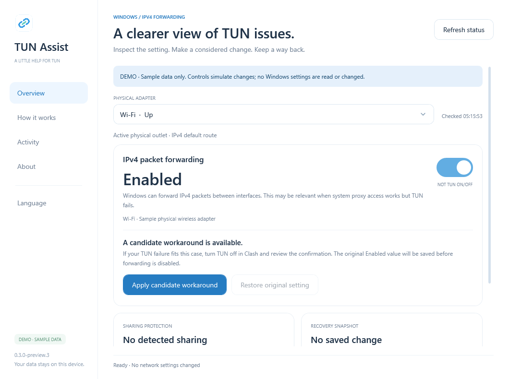

# TUN Assist

A small Windows utility for inspecting a possible IPv4-forwarding cause of Mihomo / Clash TUN failures, with a saved path back when a change is appropriate.

**[Download TUN Assist for Windows](https://github.com/catyan0930712-maker/mihomo-tun-forwarding-diagnostics/releases/download/v0.3.0-preview.3/TunAssist-0.3.0-preview.3.exe)**

`0.3.0-preview.3` · One portable EXE · 373 KiB · Seven display languages  
Windows 10/11 x64 · .NET Framework 4.8 · Built-in Windows PowerShell 5.1

This is an unsigned **pre-release**. Download the EXE from the [release page](https://github.com/catyan0930712-maker/mihomo-tun-forwarding-diagnostics/releases/tag/v0.3.0-preview.3) and open it directly. The explanation and tutorial are built in.

The connected-link icon is used for the EXE, window and sidebar. This branding update is cosmetic; forwarding, protection, recovery and language behavior are unchanged.



## What it does

TUN Assist reads IPv4 packet forwarding on your physical internet adapter and shows its role, sharing protections and recovery-record status. It explains why a read is incomplete and keeps network actions unavailable when the required checks fail.

For a suitable case, **Apply candidate workaround** saves and verifies the original value before disabling forwarding. **Restore original setting** uses that saved value for the same machine and physical adapter. Viewing status is read-only, and the app never elevates itself.

The tool works alongside Clash. You continue to manage subscriptions, nodes, DNS, routing rules, TUN stacks and the Mihomo core in Clash. The forwarding switch concerns a Windows packet-forwarding property; it does not switch Clash TUN or disable IPv4 or Wi-Fi.

## Why it exists

On one Windows host, system-proxy access worked while TUN connections repeatedly timed out. Stack changes, a DNS override and forcing the physical WLAN outlet did not restore consistent access.

The user found that IPv4 forwarding was enabled on WLAN and manually disabled it. Connectivity returned. Automatic outlet selection then worked with forwarding still disabled, and Mips was later reported working too.

This observation led to a focused tool that makes the setting and recovery option visible. It is one documented sequence, not proof of a universal TUN cause. There is no measured performance gain, complete same-host A/B/A/B experiment or confirmed reboot-persistence result.

## Three steps

### 1. Inspect

Open the app normally. In **Overview**, select the physical Wi-Fi or Ethernet adapter actually used for internet access and choose **Refresh status**.

Read **IPv4 packet forwarding**, the adapter role, **Sharing protection**, **Recovery snapshot** and the scan time. A disconnected adapter may still have forwarding Enabled; that does not make it the active internet outlet. `Unknown` is not Disabled or Absent: read the underlying error. An administrator-access requirement for protected storage does not mean there is no snapshot.

### 2. Review before changing

If the failure fits this case and an action is eligible, turn TUN off yourself in Clash. Close TUN Assist, right-click the EXE and choose **Run as administrator**, then refresh and verify the exact selected adapter.

Read the confirmation and acknowledge that no ICS, hotspot, bridge or other subnet depends on forwarding. Enter `NO-SHARING` and `FIX` when requested. Unknown inspection, NAT, sharing/routing services and protected topology block network writes. The app does not stop services or remove configuration to bypass those protections.

If your network already works with forwarding Disabled, leave it working. Do not enable forwarding just to test the control.

### 3. Verify or recover

Manage the Mihomo core in Clash and test actual websites and applications. A displayed forwarding value is not a TUN connectivity test.

To undo the tool's change, select the same physical adapter and use **Restore original setting** with a valid recovery record. The app cannot infer the original value after an earlier manual change, so it does not provide an arbitrary Enable action. If the saved original is already active, Restore rechecks it and can clear the record with `RESTORE` confirmation only, without changing the network.

Keep the app open while an operation is running. If recovery cannot be verified, retain the snapshot and stop repeating changes for local review.

## Choose your language

Open **Language** in the left navigation: English, Japanese, Simplified Chinese, Malay, Italian, German or Russian. English is the default; this repository's documentation is in English.

Language selection changes the interface only. Adapter names, identifiers, native system/engine messages and the required `NO-SHARING`, `FIX` and `RESTORE` words remain unchanged.

An ordinary non-administrator live session remembers the choice in `%LocalAppData%\TunAssist\language.txt`. Administrator and demo sessions use a session-only selection.

## Recovery and privacy

Original values are stored in machine-scoped snapshots under `%ProgramData%\MihomoTunForwardingToolkit\Snapshots-v2`, with Windows DPAPI protection and SYSTEM/Administrators permissions. Existing records are not overwritten. The app validates the machine, interface, schema and age before restoration. Closing or deleting the EXE does not undo a change or delete its recovery record.

The app changes only one physical adapter's IPv4 forwarding in ActiveStore. Reboot persistence has not been established. Third-party routing dependencies cannot all be detected, so your own topology review remains necessary.

There is no telemetry, downloaded code or automatic diagnostic upload. **Activity** stays local unless you copy it. Redact adapter identifiers and private information before sharing records or screenshots; do not upload protected snapshots.

## Validation

The user reported that `0.3.0-preview.2` passed their testing. That report did not specify individual live Fix/Restore actions. This `0.3.0-preview.3` build incorporates the selected icon and public-release wording; it is not the exact previously user-tested binary.

This rebuilt preview passed 109 safety-core mocks, 42 bridge mocks and 28 localization checks per tested PowerShell engine; 91 compiled EXE self-tests; and 25 source/resource checks. The two test engines were Windows PowerShell 5.1.26100.9587 and PowerShell 7.6.5. Isolated tests made no real network-setting writes. The embedded icon matched its source, and 21 fixture renders covered Overview, Language and About across the seven languages. Earlier preview.2 read-only application results were checked against independent Windows inspection; those live reads were not repeated for this cosmetic update.

Live administrator storage, actual provider writes, compensation, restoration and end-to-end GUI/TUN recovery remain unverified. The app remains a pre-release; these results do not establish a universal fix, uninterrupted recovery, all Windows configurations or numerical performance gains.

## Verify the download

File: `TunAssist-0.3.0-preview.3.exe` · **381,952 bytes**

```text
SHA256
64e5d1c26a3b1c75a0e389dbe26dfb4f93d8cb0520807bfd03648663d2160c29
```

SHA-256 verifies file integrity, not publisher identity. This EXE is unsigned. If Windows prevents launch, stop and report the message; the guide does not require changing Windows security settings.

[MIT License](LICENSE) · [Security](SECURITY.md)

Unofficial community software, unaffiliated with Mihomo, Clash Verge Rev or Microsoft.
